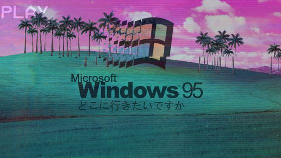
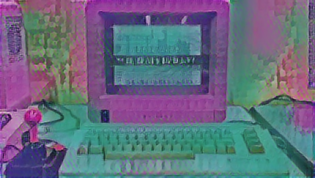

# ＶＡＰＯＲ　ＧＡＮ
ＶＡＰＯＲ　ＧＡＮ　ＵＳＩＮＧ　ＮＥＵＲＡＬ　ＳＴＹＬＥ　ＴＲＡＮＳＦＥＲ

# スタイル

# ＲＥＳＵＬＴ

Source: CNN.com

# ＲＥＦＥＲＥＮＣＥＳ

[Neural style transfer](https://www.tensorflow.org/tutorials/generative/style_transfer)

[magenta/arbitrary-image-stylization-v1-256](https://tfhub.dev/google/lite-model/magenta/arbitrary-image-stylization-v1-256/fp16/prediction/1)

Gatys, Leon A., Alexander S. Ecker, and Matthias Bethge. "A neural algorithm of artistic style." arXiv preprint arXiv:1508.06576 (2015).

Style image: https://id.pinterest.com/pin/92746073563558907/

